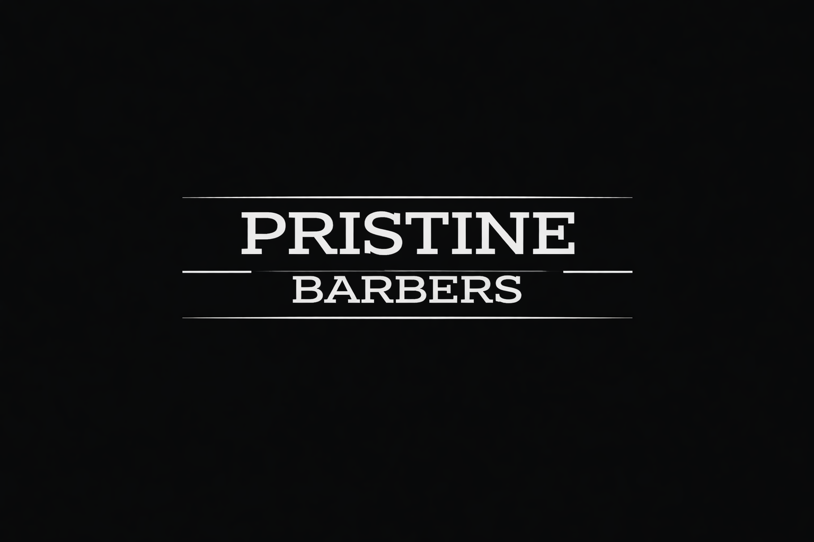

# Pristine Barbers

A production website for an independent Bournemouth barbershop, designed to turn local search traffic into bookings.

**[View the live website](https://pristinebarbers.co.uk)**



## What shipped

- Responsive service, pricing, story and practical-information pages.
- Direct Booksy booking routes and clear mobile conversion paths.
- Customer reviews, opening times, location and social proof.
- Local-business structured data, canonical metadata, sitemap and crawler controls.
- Optimized images and social-sharing metadata.

## Stack

Next.js, React, TypeScript and CSS Modules.

## Local development

Install dependencies and start the development server:

```bash
npm install
npm run dev
```

Open [http://localhost:3000](http://localhost:3000).

## Checks

```bash
npm run lint
npm run build
```
